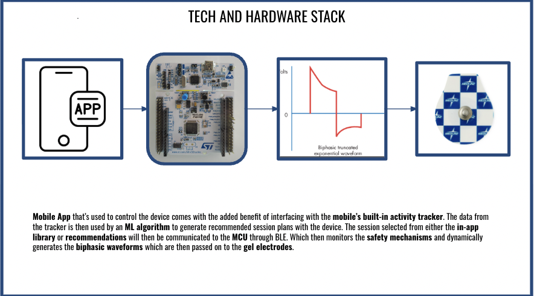

# NORA – Neurostimulation System Design

NORA is a wearable neurostimulation system designed for controlled electrode stimulation with adaptive session control, safety monitoring, and mobile-based user interaction. The system integrates embedded hardware, firmware control, and mobile application communication to generate programmable biphasic stimulation waveforms.

---

## Overview

The project focuses on developing a safe and modular neurostimulation platform capable of:

- Electrode switching and steering
- Programmable biphasic pulse generation
- Real-time sensing and safety monitoring
- Mobile app control via Bluetooth Low Energy (BLE)
- Adaptive stimulation sessions

The system architecture combines embedded electronics, signal generation, and user-interface integration.

---

## System Architecture

### User Interaction Layer

- Physical controls:
  - Start/stop button
  - Mode selector
  - Status LEDs
- Mobile application interface:
  - Session configuration
  - Device control
  - Logging and monitoring

---

## Hardware Design

### MCU (STM32)

Acts as the central control unit:

- High-resolution hardware timers for biphasic pulse timing
- Dead-time control and sequencing
- Mapping protocol management
- Safety logic implementation
- BLE communication stack
- Data logging

---

### Pulse Generator and Driver

- Gate driver controlled via MCU-level logic
- H-bridge (MOSFET) design for bipolar stimulation output
- Current limiting circuitry
- DC-blocking network for safety

---

### Electrode Switching and Steering

- Multiplexer / analog switching network
- Selective activation of electrode pairs
- Controlled sequencing with hardware interlocks

---

### Sensing and Feedback

- Shunt current sensing for real-time monitoring
- Impedance measurement using AC test pulse
- ADC-based demodulation
- Optional physiological feedback:
  - GSR
  - PPG sensors

---

### Power Management and Protection

- Rechargeable Li-ion battery system
- TP4056 charging module
- Buck/boost converter for adjustable stimulation voltage
- TVS/Zener protection
- Polyfuse and bleed resistors

---

### Safety Mechanisms

- Hardware interlock disabling driver during faults
- Overcurrent protection
- Impedance range monitoring
- Watchdog timer with fail-safe firmware

---

## Signal Flow

User Input → Firmware Session Controller → Waveform Generator → Output Driver → Electrodes

Mobile application input is integrated into the control loop via BLE communication.

---

## Technical Approach

---

## Key Features

- Biphasic truncated exponential waveform generation
- Adaptive stimulation control
- Embedded safety-first design
- Modular electrode switching
- Real-time monitoring

---

## Tools & Technologies

- STM32 Microcontroller
- Embedded C / Firmware development
- Analog circuit design
- Power electronics
- BLE communication
- Mobile application interface

---

## Applications

- Neurostimulation research
- Rehabilitation devices
- Wearable neuromodulation systems
- Biomedical prototyping

---

## Project Status

System architecture, circuit design and implementation completed. Biphasic pulse generated using the given circuit, shown below. 

